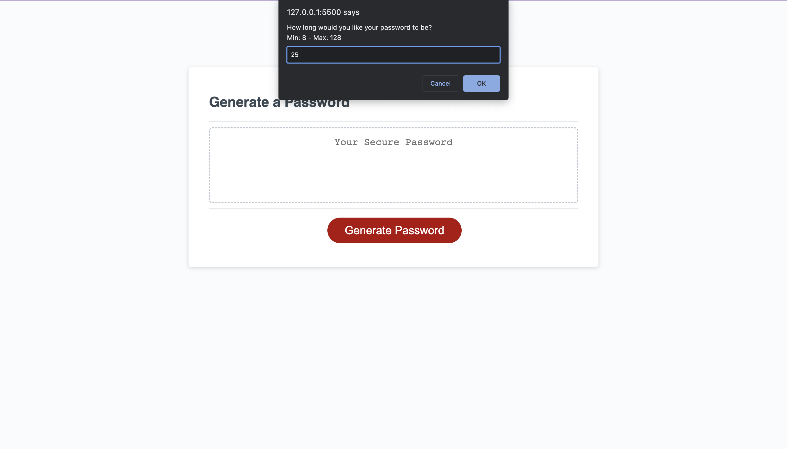
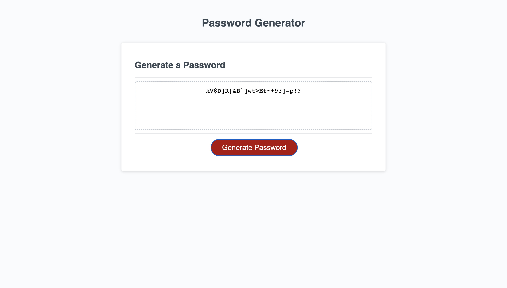

# Create-a-Password

## Description

This site was created using HTML, CSS, and JavaScript. The purpose of this site is to use JavaScript functions that randomizes characters to create a password. This is an easy way to come up with passwords that can be more secure than someone may have thought of before. During the creation of this site I learned much more about functions, for loops, and how JavaScript works. I utilized the use of arrays, objects, alerts, and confirmation methods. 

## Installation

N/A

## Usage

To use this site, click the 'Generate Password' button:

Then follow the prompts that show up on the screen. 

The password created following the user criteria will be displayed in the box shown.

## Credits

Eric Sayer: Instructor of UMN Full Stack Bootcamp as tutor.

## License

N/A

## Tests

Button initiates prompts -> Check: good.
Improper input causes error -> Check: good.
Prompts provide input criteria -> Check: good.
Generated password is displayed -> Check: good.
Generated password meets input criteria -> Check: good.
